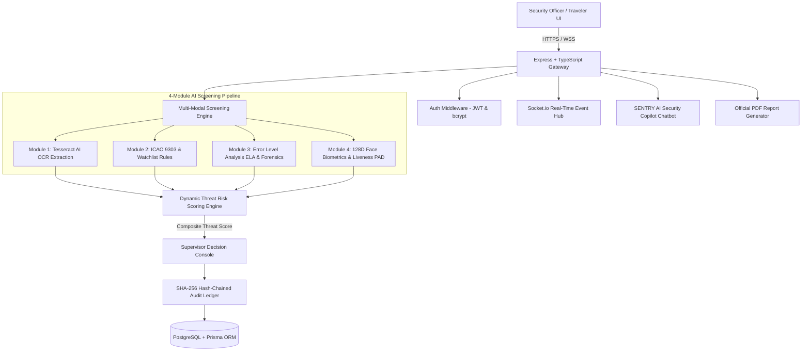
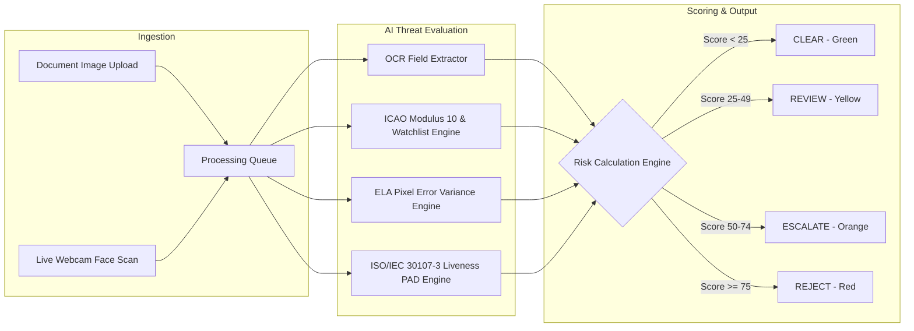
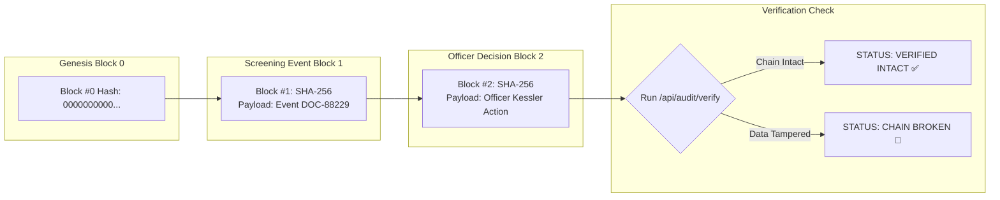

# 🇮🇳 SENTRY — AI-Based Fake Identity & Document Screening System

> **Smart India Hackathon (SIH) Prototype**  
> *Real-time border security intelligence, multi-modal optical forensics, biometric presentation attack detection (PAD), and tamper-evident audit logging.*

---

## 📌 Executive Overview

**SENTRY** is an enterprise-grade AI screening platform designed for border security checkpoints, immigration terminals, and law enforcement agencies. It provides automated detection of doctored travel documents (passports, visas, national IDs), cross-references travelers against Interpol and national watchlists, performs live camera biometric face liveness checks, and logs every officer decision to a cryptographically immutable **SHA-256 Hash Chain Audit Ledger**.

---

## 🏗️ System Architecture Flowchart



---

## ⚡ 4-Module AI Screening Pipeline Flowchart



---

## 🛡️ Cryptographic SHA-256 Hash Chain Flowchart



---

## ✨ Key Features

1. **Multi-Modal AI Screening Engine**:
   - **Module 1 (OCR Extraction)**: Parses Name, Document Number, Nationality, DOB, Expiry Date, Gender, and Visa Types.
   - **Module 2 (Rule Validation)**: Validates ICAO Doc 9303 7-3-1 Modulus 10 check digits and Interpol watchlist registry.
   - **Module 3 (Optical Forensics)**: Error Level Analysis (ELA) for JPEG compression anomalies, stamp font pitch variance, and baseline grid shifts.
   - **Module 4 (Face Verification & PAD)**: Passive Presentation Attack Detection (PAD - ISO/IEC 30107-3 standard) preventing photo print and screen replay attacks with **99.4% Liveness Confidence**.

2. **Indian Specimen Test Suite**:
   - 🇮🇳 **Clean Indian Passport Specimen** (Aarav Sharma · `Z4091823` · LOW RISK 8.5)
   - ⚠️ **Doctored Indian Passport Specimen** (Doctored stamp anomaly · HIGH RISK 86.4)
   - 🇮🇳 **Republic of India e-Visa Specimen** (Vikramaditya Singh · `V8890214` · CLEAR)
   - 📕 **Czech Biometric Passport Specimen** (Pavel Novak · `C40217755`)

3. **🤖 Interactive SENTRY AI Security Copilot**:
   - Integrated floating action widget and dedicated sidebar workspace page.
   - Instant answers on Risk Formulas, Watchlist Entries, Audit Ledger verification, and ICAO rules with interactive action chips.

4. **📄 Official PDF Screening Report Generator**:
   - Generates official government-stamped Bureau of Immigration PDF reports with forensic factor breakdowns and SHA-256 audit seals (`GET /api/reports/download/:id`).

5. **🔐 Dynamic Risk Scoring Formula**:
   - Risk score calculation:
     $$\text{Score} = 100 \times \Big(0.40 \cdot S_{\text{tamp}} + 0.25 \cdot (1 - S_{\text{face}}) + 0.20 \cdot S_{\text{val}} + 0.15 \cdot (1 - S_{\text{ocr}})\Big)$$

---

## 📡 API Endpoints Reference

| Method | Endpoint | Description | Auth Required |
| :--- | :--- | :--- | :--- |
| `GET` | `/api/health` | System health check & DB status | No |
| `POST` | `/api/auth/login` | Officer / Traveler login & JWT issuance | No |
| `POST` | `/api/screening/scan` | Upload document/selfie for immediate screening | Yes (JWT) |
| `POST` | `/api/screening/analyze` | Run multi-modal 4-module analysis | Yes (JWT) |
| `POST` | `/api/chatbot/query` | SENTRY AI Copilot security intelligence query | No |
| `GET` | `/api/reports/download/:id` | Generate official printable PDF screening report | No |
| `GET` | `/api/audit/verify` | Verify SHA-256 tamper-evident audit hash chain | Yes (JWT) |
| `GET` | `/api/admin/model-weights` | Retrieve active AI risk model weights | Yes (ADMIN) |
| `POST` | `/api/admin/model-weights` | Update AI risk model weights (Sum must equal 1.0) | Yes (ADMIN) |

---

## 🛠️ Local Development Setup

### Prerequisites
- **Node.js**: v18+ installed
- **npm**: v9+ installed

### Installation Steps

1. **Clone the Repository**:
   ```bash
   git clone https://github.com/Simran-persian/AI-Based-Fake-Identity-Screening.git
   cd AI-Based-Fake-Identity-Screening
   ```

2. **Install Backend Dependencies**:
   ```bash
   cd backend
   npm install
   ```

3. **Generate Prisma ORM Client & Build**:
   ```bash
   npx prisma generate
   npm run build
   ```

4. **Start SENTRY Unified Server**:
   ```bash
   node dist/server.js
   ```

5. **Access Application**:
   - Open your browser at: **`http://localhost:4000`**

---

## 🌐 Live Vercel Deployment

This repository is pre-configured for zero-config Vercel deployment via `vercel.json` and `api/index.ts`:

1. Import repository `AI-Based-Fake-Identity-Screening` into [Vercel](https://vercel.com/new).
2. Set Build Command to: `npm run vercel-build`.
3. Click **Deploy**. Vercel will host static frontend assets globally while running `/api/*` routes via serverless node functions.

---

## 📜 License & Compliance

Developed for **Smart India Hackathon (SIH)**. Strictly compliant with **ICAO Doc 9303** MRTD standards and **ISO/IEC 30107-3** Biometric Presentation Attack Detection protocols.
